# MCP Control Center · Enterprise MCP Governance Platform

[中文](./README.md) | English

A local-first governance platform for enterprise MCP infrastructure. It brings Services, MCP contracts, prompts, authentication, call quality, error context, versions, and publishing workflows into one operational control plane.

This is not another public MCP marketplace, and it is more than a gateway configuration panel. It addresses a different question: **once an organization has built 50, 100, or more internal MCP tools, how can product, engineering, operations, and platform teams actually govern them at scale?**

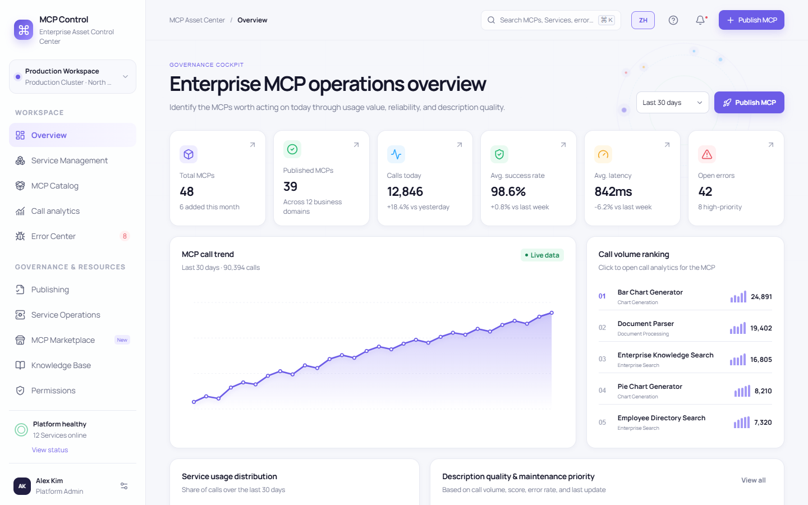

> This repository is currently a complete interactive prototype. It uses structured demo data, implements the major pages, dialogs, navigation paths, and cross-page state changes, and exposes an API adapter contract for future integration. It does not yet connect to a production database, real traces, approval systems, or MCP process management.

---

## Why this project exists

Most open-source MCP management projects focus on one of two areas:

1. Public MCP marketplaces, registries, installation catalogs, and third-party connectors.
2. Runtime gateways, routing, authentication, proxies, and protocol adapters.

Those capabilities matter, but an enterprise running its own MCP infrastructure faces another set of problems:

- Business teams develop MCPs independently, resulting in inconsistent naming, descriptions, parameters, and error codes.
- A single business capability may contain many tools without a shared owner, lifecycle, or quality view.
- A tool may be live, yet nobody knows whether AI clients actually select it—or why they do not.
- High-volume tools can have poor descriptions, while low-value tools keep consuming maintenance capacity.
- Token cost, latency, and failures are scattered across logs, making infrastructure waste hard to locate.
- Error logs rarely reconstruct the user request, model decision, tool arguments, tool version, and prompt version together.
- Publishing, unpublishing, canary rollout, approval, and rollback often depend on spreadsheets and chat messages.
- Sensitive tools may require authorization for every call, a policy that ordinary OAuth or shared credentials cannot express.

MCP Control Center unifies these concerns into one enterprise governance model:

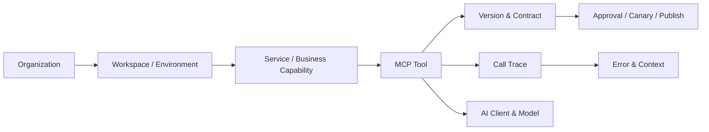

---

## Key advantages

| Capability | What it solves |
| --- | --- |
| Service hierarchy | Groups MCPs by business capability or department, with shared ownership and operational boundaries |
| Multi-level authentication | Supports platform credentials, per-user OAuth, user keys, no-auth tools, and per-call strong authentication |
| Contract governance | Centralizes input/output schemas, constraints, examples, prompts, resources, transport, and timeouts |
| AI description quality | Scores tool descriptions, simulates use cases, and highlights ambiguous boundaries and mis-selection risks |
| Lifecycle workflow | Standardizes creation, sandbox validation, approval, canary rollout, publish, unpublish, rollback, and retirement |
| Error-code location | Maps an isolated error code back to its MCP, Service, affected version, and complete call context |
| Usage and cost analysis | Compares calls, success rate, latency, P95, token consumption, and AI selection rate by date range |
| Intent intelligence | Uses aggregated call patterns to identify common user needs and guide MCP and prompt optimization |
| Local-first design | Keeps the prototype and future local-agent workflow independent from mandatory cloud storage |

---

## Features and screenshots

### 1. Enterprise MCP governance overview

The overview is designed to answer what the team should fix first:

- MCP, Service, published asset, and active error counts.
- Calls, success rate, average latency, and average token usage.
- Usage trends and rankings.
- Service-level usage distribution.
- Description quality and maintenance priority.
- Governance recommendations for high-volume/low-score, stale, low-usage, or high-error tools.


### 2. Service as a business governance layer

Service is a first-class concept in this project.

For example, a “Chart Generation” Service may own:

- Bar chart generation
- Pie chart generation
- Line chart generation
- Chart export

The Service view aggregates child MCPs, calls, success rate, tokens, latency, errors, owners, versions, and connected AI clients. A quick drawer supports operational inspection, while a full detail page supports deeper governance.

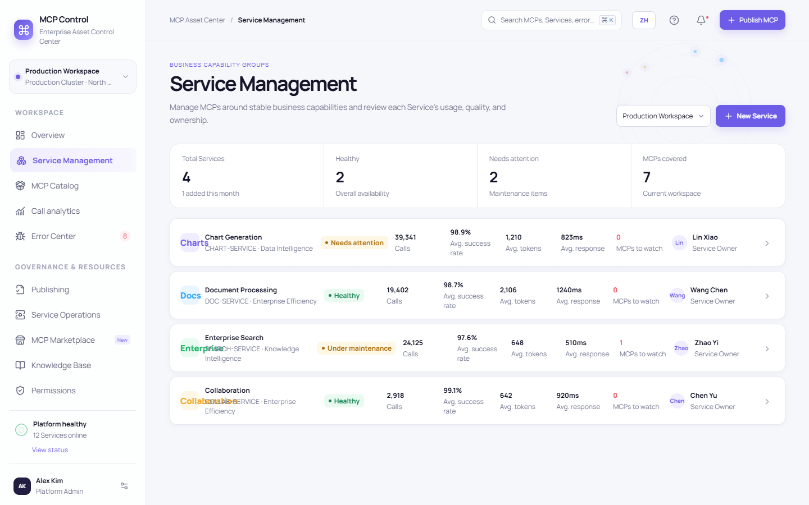

### 3. MCP assets, contracts, and prompt management

Each MCP detail page brings together:

- Unique ID, Service, version, status, owners, and AI clients.
- Repository, hosting, administration, and sandbox endpoints.
- Tool description prompt and AI description-quality score.
- Input/output schemas, field types, required fields, defaults, and constraints.
- Request, response, and error examples.
- Resources, Prompts, Transport, authentication, and timeout settings.
- Recommended and prohibited scenarios, trigger intents, and mis-selection risks.
- Version diffs, change history, and manual test execution.

This makes it possible to repair production contract, parameter, prompt, and response issues from a single control plane.

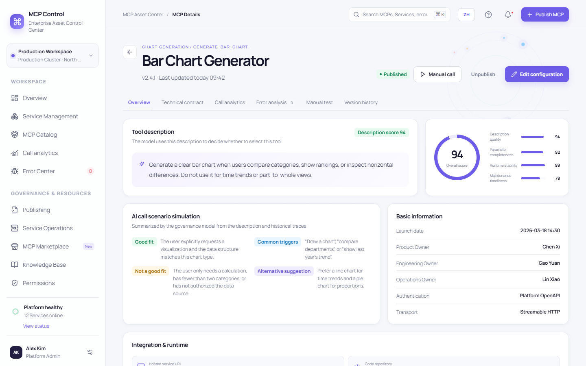

### 4. Tiered authentication and per-call strong authentication

MCP Control Center models five authentication strategies:

1. **Platform OpenAPI** — centrally encrypted credentials shared by authorized users.
2. **User OAuth 2.0** — independent authorization and revocation for every user.
3. **User-provided key** — user-owned credentials without plaintext persistence.
4. **Strong authentication** — high-risk or compliance-sensitive tools require the user to enter a password for every call.
5. **No authentication** — only for low-risk tools in isolated networks.

Strong authentication is never reused across calls. The password is excluded from traces, and the manual test workflow simulates “enter password → authorize this call → expire immediately after completion.”

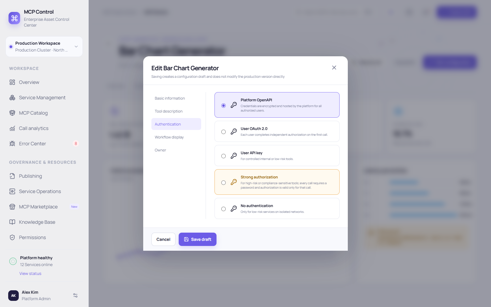

When a manual test targets a strongly authenticated MCP, the user must authorize the individual call with a password:

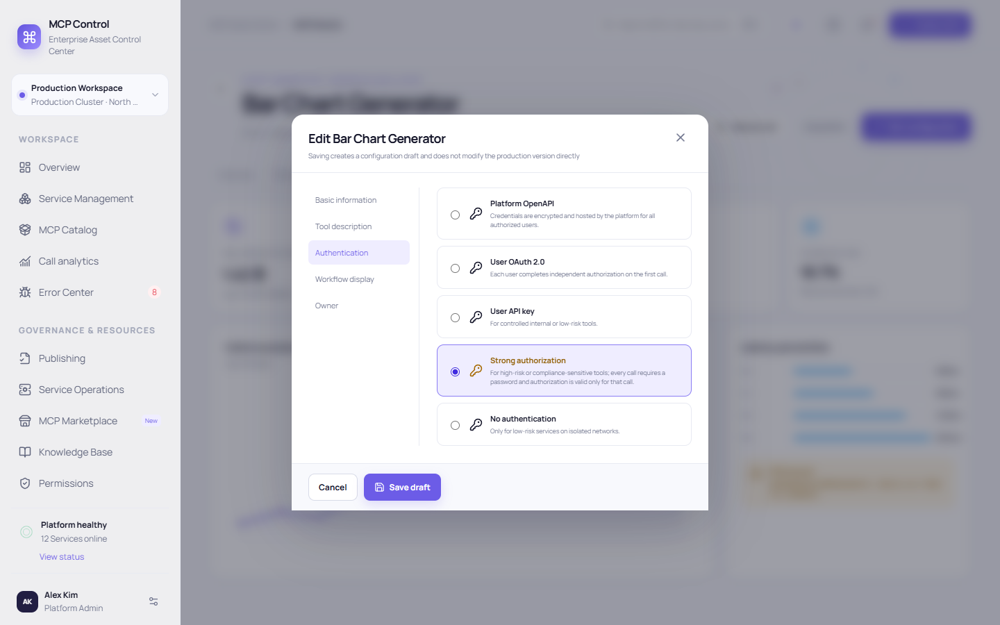

### 5. Call, performance, and token analytics

Analytics supports today, the last 7/15/30/90 days, and custom date ranges.

Per-MCP metrics include:

- Call volume and trend.
- Success rate and first-call success rate.
- Average latency plus P50/P95/P99.
- Average token consumption.
- AI selection, fixed workflow calls, manual calls, and retry share.
- Period-over-period change.

These metrics reveal:

- Which MCP consumes the most tokens.
- Which MCP slows down the entire infrastructure.
- Which tools were built but are rarely selected by AI.
- Which high-volume tools have description, stability, or cost problems.

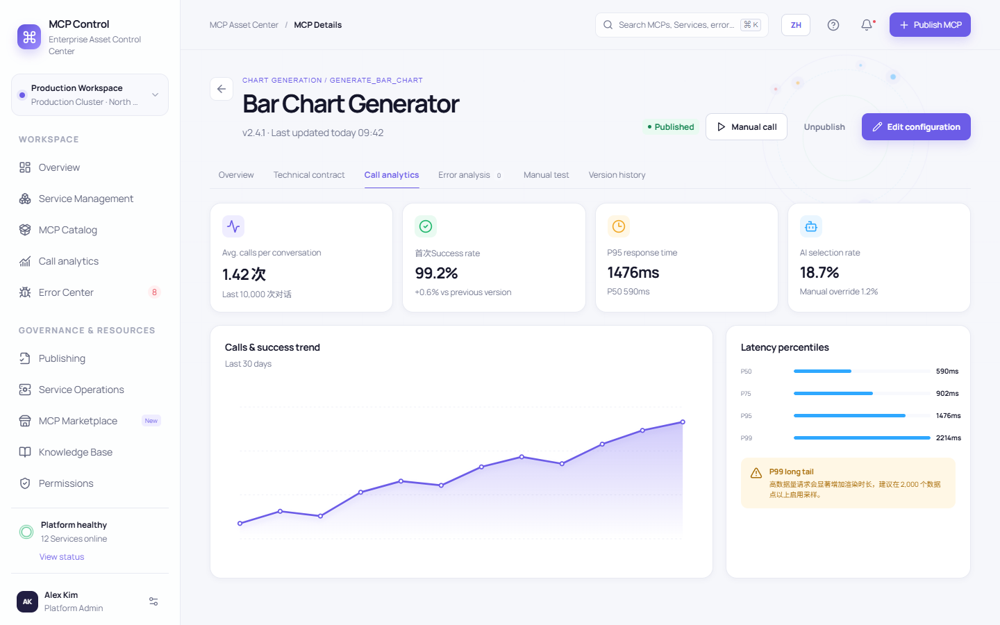

### 6. Error-code location and complete call context

When operations only has an error code such as `MCP-AUTH-401`, the platform can locate:

- The owning MCP.
- The owning Service.
- Error category and severity.
- Affected versions, AI clients, and scope.
- Current status and responsible owner.

Opening a result shows the original user request, AI conversation, model selection reason, actual tool input, tool output, stack/context, surrounding calls, description version, MCP version, and recommended fix.

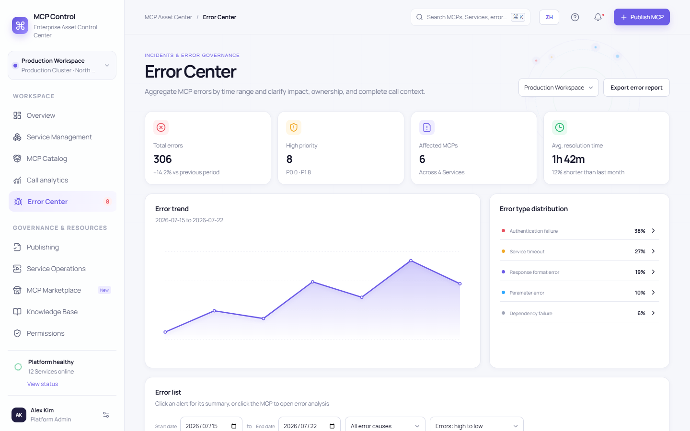

The error-context modal reconstructs a de-identified demo trace: the user's original question → the AI's tool-selection decision → MCP request parameters → tool output → impact and fix suggestion. The `source_url: null` field in the output is the concrete cause shown in the screenshot for the missing citation field.

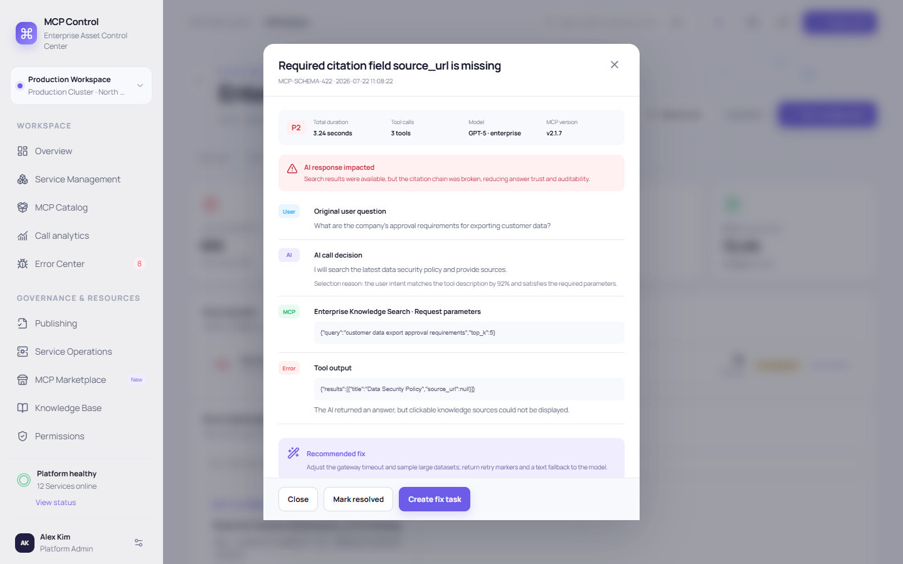

### 7. Publishing, canary rollout, and lifecycle

Business teams can submit MCPs through a shared workflow instead of spreadsheets and offline coordination:

1. Product metadata and ownership.
2. Endpoint, Transport, schema, and authentication.
3. Sandbox contract, connectivity, security, and tool-selection tests.
4. Product, engineering, security, and operations approval.
5. Target workspaces, rollout percentage, observation window, and automatic rollback conditions.

The platform records version, approval, publish, unpublish, rollback, and audit events.

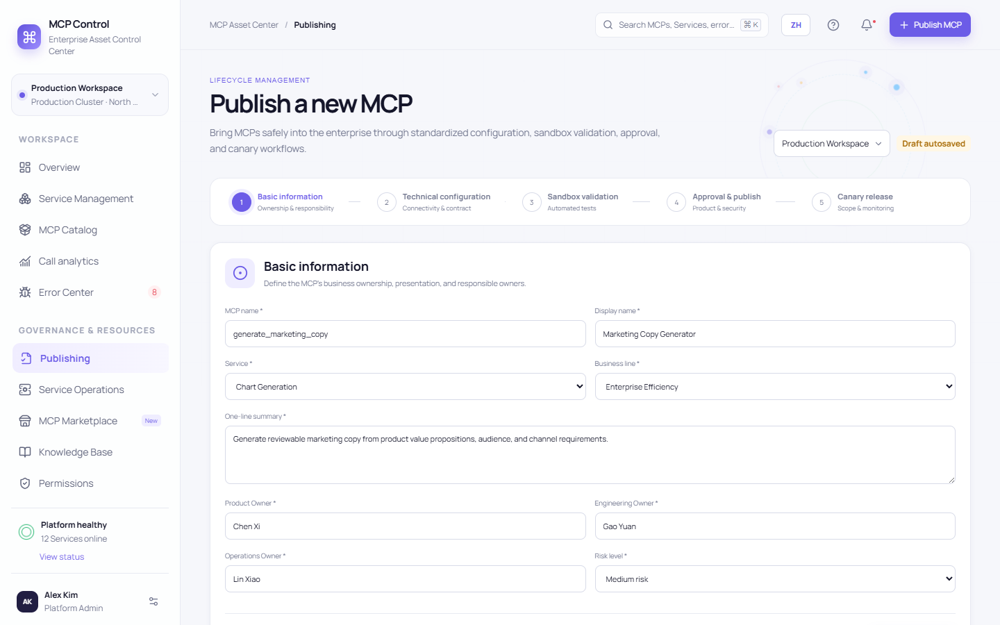

### 8. Roles, members, and Workspace permissions

Access control makes role membership explicit:

- View, search, add, edit, and remove role members.
- Configure read, edit, and operational permissions per Workspace.
- Require approvals for high-risk modules.
- Create custom roles.
- Audit permission and membership changes.

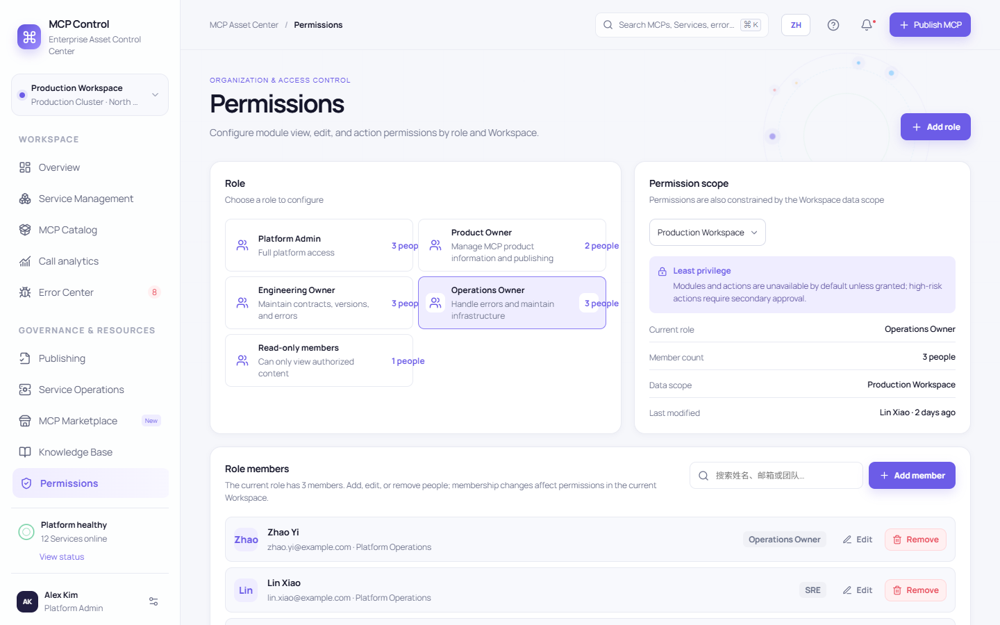

### 9. Service maintenance and local MCP configuration

The maintenance module covers:

- MCP gateways, upstream Services, and routing tables.
- Development, test, staging, and production environments.
- Health checks, monitoring, alerts, and notification channels.
- Vault references, credential rotation, and validation.
- Claude Desktop, Cursor, Windsurf, and VS Code MCP configuration.
- Config file, command, path, connectivity, and conflict checks.
- Release-risk and incident logs.

The current version uses demo data. A future local agent can read real `mcp.json` files without uploading secrets.

### 10. MCP marketplace and knowledge base

The platform also supports governed internal adoption:

- Source, permission, and security review for official, community, third-party, and private MCPs.
- Isolated sandbox installation, health checks, and internal approval.
- Product standards, engineering manuals, onboarding workflows, and operations playbooks.
- Search, reading, editing, upload parsing, and links to MCPs and error codes.

---

## Deriving user intent from MCP usage

With enough de-identified call data, the platform can periodically aggregate:

- Categories of user questions.
- Selected and candidate MCPs.
- Success, retry, and abandonment patterns.
- Frequent parameter combinations.
- Token, latency, and failure distribution.

These patterns can reveal common infrastructure intents—such as searching internal policy, generating comparison charts, or synchronizing project documents—and guide:

- New MCP planning.
- Tool-description and parameter improvements.
- Duplicate-tool consolidation.
- Missing capability discovery.
- Model routing and prompt optimization.

Production implementations should only use data that is de-identified, aggregated, and permitted by organizational privacy policy.

---

## Run locally

### Requirements

- Node.js `>= 22.13.0`
- npm

### Install

```bash
git clone https://github.com/JACEZ123/mcp-control-center.git
cd mcp-control-center
npm install
npm run dev
```

Open:

```text
Open the local development URL printed by the terminal (provided by Vinext)
```

### Build and test

```bash
npm run lint
npm test
npm run build
npm start
```

---

## Current architecture

```text
app/
  control-center/
    app.tsx                 Shell, navigation, global search, and role view
    modules-core.tsx        Overview, Services, MCP details, contracts, tests, versions
    modules-ops.tsx         Analytics, errors, publishing, maintenance, local config
    modules-resources.tsx   Marketplace, knowledge base, permissions, and members
    store.tsx               Cross-page demo state and audit events
    data.ts                 Structured demo data
    types.ts                Core domain models
    api.ts                  Contract for a real API adapter
  globals.css               Visual system and responsive styles
docs/
  screenshots/              README screenshots
tests/
  rendered-html.test.mjs    Module and interaction-path tests
```

The frontend uses React, TypeScript, a Next.js-compatible app structure, and Vinext/Vite for builds.

## Code size

As of this version, the core source contains **5,697 non-blank code lines** and **5,866 total lines** across 16 source files. The count covers `app/control-center`, `app/page.tsx`, `app/layout.tsx`, `app/globals.css`, `app/chatgpt-auth.ts`, and `tests/rendered-html.test.mjs`; it excludes dependencies, build output, screenshots, documentation, lockfiles, and unrelated directories.

---

## Reserved API surface

The demo adapter in `app/control-center/api.ts` can be replaced with a real backend:

```text
GET    /api/overview
GET    /api/services
GET    /api/services/:serviceId
GET    /api/mcps
GET    /api/mcps/:mcpId
GET    /api/mcps/:mcpId/metrics
GET    /api/mcps/:mcpId/errors
GET    /api/errors/:errorId/context
POST   /api/mcps
PATCH  /api/mcps/:mcpId
POST   /api/mcps/:mcpId/versions
POST   /api/mcps/:mcpId/publish
POST   /api/mcps/:mcpId/unpublish
GET    /api/clients
GET    /api/marketplace
GET    /api/knowledge-base
```

Recommended integration order:

1. MCP Registry and asset database.
2. Gateway, call logs, and distributed tracing.
3. Description versions and a schema registry.
4. Enterprise OAuth, Vault, strong authentication, and approvals.
5. A local client-configuration agent.
6. Alerting, ticketing, and knowledge systems.

---

## Security and privacy

- Never commit GitHub tokens, OAuth secrets, API keys, or real MCP credentials.
- Strong-auth passwords must be valid for one call only and excluded from logs, traces, and audit text.
- Call context must be de-identified before long-term retention.
- Third-party MCPs should be version-pinned and reviewed for dependencies, licenses, network permissions, and data scope.
- Local client credentials should use secure references and never appear in plaintext exports.
- Before pushing, inspect `git status`, `.env`, local configs, and temporary exports.

---

## Status and roadmap

Completed:

- A Chinese-first interactive prototype with responsive layouts.
- Service, MCP, error, analytics, publishing, maintenance, marketplace, knowledge, and permission modules.
- Cross-page demo state, audit logs, and complete interaction flows.
- Chinese and English project documentation with real screenshots.

Recommended next steps:

- Connect a real database and RBAC system.
- Integrate OpenTelemetry, traces, and gateways.
- Read real local MCP client configuration.
- Integrate approvals, tickets, and alerting.
- Add automated tool-description evaluation and scheduled governance.
- Add privacy-preserving intent clustering from de-identified traces.

---

## License

This project uses the MIT License. You may freely use, copy, modify, merge, publish, and sublicense it, but you must retain the `Jace` attribution and the license text in copies or substantial portions. Production use must still follow your organization’s security, privacy, and compliance requirements.

## Documentation reference

The bilingual README organization was inspired by [JACEZ123/novel-generator](https://github.com/JACEZ123/novel-generator): why the project exists, advantages, features with screenshots, installation, layout, security, and roadmap. The product content and positioning here are entirely focused on enterprise MCP governance.

## Bilingual interface

Use the `EN / 中文` toggle in the top-right corner to switch the product interface. Navigation, page titles, common actions, error context, authentication dialogs, and core demo data follow the selected language, which is persisted in the current browser for English-speaking teams.
