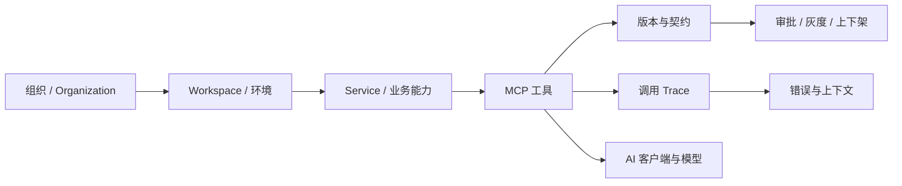

# MCP Control Center · 企业自研 MCP 管控平台

中文 | [English](./README.en.md)

一个面向企业内部 MCP Infra 的本地优先管理平台，用于统一管理 Service、MCP 工具契约、Prompt、鉴权、调用质量、错误上下文、版本与上下架流程。

它不是又一个 MCP 市场，也不仅是 Gateway 配置面板。它试图解决的是：**当一家公司已经自研了 50、100 甚至更多 MCP 工具之后，如何让产品、研发、运维和运营团队真正管得住、看得清、改得动。**


> 当前仓库是一个功能完整的交互原型：使用结构化演示数据，所有主要页面、弹窗、跳转和跨页面状态均可操作，并预留真实 API 适配层。它尚未接入生产数据库、真实 Trace、审批系统和 MCP 进程管理。

---

## 为什么做这个项目

当前开源生态中的 MCP 管理产品，主要集中在两类方向：

1. 面向公开生态的 MCP 市场、Registry、安装目录和第三方连接器。
2. 面向运行时的 Gateway、路由、鉴权、代理和协议适配。

这些能力很重要，但企业自建 MCP Infra 后还会遇到另一组问题：

- 不同业务部门独立开发 MCP，命名、描述、参数和错误码标准不一致。
- 一个业务 Service 下可能有十几个工具，却缺少统一的归属、负责人和版本视图。
- MCP 已经开发上线，但 AI 是否真正使用、为什么不用、是否误调用，团队并不清楚。
- 某些 MCP 调用量很高但描述评分很低；某些长期无人调用却持续占用维护成本。
- Token 消耗、响应时长和错误率分散在日志中，难以判断整个 Infra 的资源浪费发生在哪里。
- 报错后只能看到一段错误日志，无法还原用户问题、模型决策、工具参数、工具版本和 Prompt 版本。
- 上架、下架、灰度、审批和回滚依赖线下沟通，各业务部门无法按照统一规范自主维护。
- 敏感 MCP 需要“每次调用重新授权”，但普通 OAuth 或共享密钥无法表达这种风险策略。

MCP Control Center 将这些问题统一到一个企业治理模型中：



---

## 核心亮点

| 能力 | 解决的问题 |
| --- | --- |
| Service 业务分层 | 将同一业务、部门或能力域下的多个 MCP 统一管理，明确负责人、调用质量和维护边界 |
| 多级鉴权 | 支持平台统一凭证、用户 OAuth、用户密钥、无需鉴权，以及每次调用输入密码的强鉴权 |
| 工具契约治理 | 集中维护输入输出 Schema、字段约束、示例、Prompt、Resources、Transport 和超时 |
| AI 描述质量 | 评估工具描述、调用边界和误调用风险，给出 AI 场景模拟与修改建议 |
| 生命周期管理 | 将创建、沙盒验证、审批、灰度、上架、下架、回滚和废弃统一到规范流程 |
| 错误码定位 | 只拿到错误码时，也能反查所属 MCP、Service、影响版本和完整调用上下文 |
| 调用与成本分析 | 按日期范围查看调用量、成功率、响应时长、P95、Token 和 AI 选择率 |
| Infra 意图洞察 | 基于聚合调用数据识别常见用户问题和高频意图，为工具设计和产品优化提供依据 |
| 本地优先 | 演示和后续本地代理均以本地数据为优先，不要求把 MCP 配置和凭证上传到云端 |

---

## 功能与界面

### 1. 企业 MCP 治理总览

总览不是只展示“在线数量”，而是帮助团队回答今天应该先处理什么：

- MCP、Service、上架资产和当前错误数量。
- 调用次数、成功率、平均响应时长和平均 Token。
- MCP 调用趋势与调用排行。
- Service 使用分布。
- 描述质量、错误率和维护优先级。
- 高调用低评分、低调用长期未更新、错误率异常等治理建议。


### 2. Service：企业业务能力分组

Service 是本项目新增的核心管理层级。

例如“图表生成”是一个 Service，下面可以维护：

- 条形图生成
- 饼状图生成
- 折线图生成
- 图表导出

Service 视角可以查看下属 MCP、整体调用量、平均成功率、Token、响应时长、错误情况、负责人和客户端接入范围。列表点击后先打开抽屉，再进入完整详情，适合快速运营和深入治理两种工作方式。


### 3. MCP 资产、契约和 Prompt 管理

每个 MCP 详情页集中展示：

- 唯一 ID、Service、版本、状态、负责人和客户端。
- 代码仓库、托管地址、管理地址和沙盒地址。
- 工具描述 Prompt 与 AI 描述质量评分。
- 输入输出 Schema、字段类型、必填项、默认值和约束。
- 请求、返回和错误示例。
- Resources、Prompts、Transport、鉴权和超时。
- AI 适用场景、不适用场景、常见触发意图和误调用原因。
- 版本差异、修改记录和手动测试。

团队可以快速修改工具描述和契约，统一处理线上 MCP 的参数、Prompt 和返回格式问题。


### 4. 分级鉴权与强鉴权

不同 MCP 的风险不同，本项目支持五种鉴权策略：

1. **平台 OpenAPI**：平台集中加密托管凭证，授权用户共享调用。
2. **用户 OAuth 2.0**：每位用户独立授权和撤销。
3. **用户密钥**：用户提供自己的密钥，平台不持久化明文。
4. **强鉴权**：用于高风险或风控敏感工具，每次调用都要求用户输入密码，只授权本轮调用。
5. **无需鉴权**：仅用于低风险、隔离网络内的工具。

强鉴权不会复用上一次授权，密码不会写入 Trace；手动测试会真实模拟“输入密码 → 授权本轮 → 调用结束后失效”的流程。


发起手动测试时，强鉴权 MCP 会在调用前要求用户完成本轮密码授权：


### 5. 调用、性能与 Token 分析

调用分析支持今天、近 7/15/30/90 天和自定义日期范围。

可以按 MCP 查看：

- 调用次数和趋势。
- 成功率与首次调用成功率。
- 平均响应时长、P50、P95、P99。
- 平均 Token 消耗。
- AI 自动选择率、工作流固定调用、人工调用和重试占比。
- 不同时间段的调用变化。

这些指标不仅用于排障，也可以发现：

- 哪个 MCP 消耗了最多 Token。
- 哪个 MCP 拖慢了整个 Infra。
- 哪些工具开发后几乎没有被 AI 使用。
- 哪些工具调用量很高，却存在描述、稳定性或成本问题。


### 6. 错误码定位与完整调用上下文

当运维只拿到一个错误码时，可以直接输入例如 `MCP-AUTH-401`，定位：

- 所属 MCP。
- 所属 Service。
- 错误类型和严重等级。
- 受影响版本、AI 客户端和调用范围。
- 当前处理状态和负责人。

点击结果会进入对应 MCP 的错误码自查，继续查看用户原始问题、AI 对话、模型选择工具的原因、实际输入参数、工具返回、错误堆栈、前后置调用、工具描述版本和修复建议。


错误上下文弹窗会还原一条脱敏后的演示 Trace：用户真实问题 → AI 调用决策 → MCP 请求参数 → 工具返回结果 → 错误影响与修复建议。工具返回中的 `source_url: null` 与截图中的“引用来源缺少必填字段”对应，便于从错误现象反推契约问题。


### 7. MCP 上架、灰度与生命周期

各业务部门可以按照统一规范自主提交 MCP，不再依赖大量线下表格和群聊：

1. 基础信息与责任人。
2. 服务连接、Transport、Schema 和鉴权。
3. 沙盒契约、连接、安全和模型选择测试。
4. 产品、技术、安全和运维审批。
5. 发布范围、灰度比例、观察窗口和自动回滚条件。

平台统一记录版本、审批、上架、下架、回滚和审计信息。


### 8. 角色、成员与 Workspace 权限

权限管理不仅配置角色矩阵，也能明确“哪些人属于这个角色”：

- 查看、搜索、新增、编辑和移除角色成员。
- 按 Workspace 设置查询、编辑和处理权限。
- 高风险模块设置审批要求。
- 新建自定义角色。
- 记录权限和成员变更审计日志。


### 9. 服务维护与本地 MCP 配置

服务维护模块覆盖：

- MCP Gateway、上游 Service 和路由表。
- 开发、测试、预发布、生产环境。
- 健康检查、监控、告警与通知渠道。
- Vault、密钥引用、凭证轮换和验证。
- Claude Desktop、Cursor、Windsurf、VS Code 的本地 MCP 配置。
- 配置文件、启动命令、路径、连接和冲突检查。
- 上线风险日志和服务事故记录。

当前版本使用演示数据，后续可通过本地代理安全读取真实 `mcp.json` 和客户端配置。

### 10. MCP 市场与知识库

平台同时保留内部接入能力：

- 官方、社区、第三方和私有 MCP 的来源、权限与安全评估。
- 安装到隔离沙盒、健康检查和内部审核。
- 产品规范、技术手册、接入流程和运维手册。
- 文档搜索、章节阅读、编辑、上传解析、关联 MCP 和错误码。

---

## 从 MCP 调用反推用户意图

当企业积累了足够多的脱敏调用数据后，平台可以周期性聚合：

- 用户问题类型。
- AI 选择的 MCP 与候选 MCP。
- 调用成功、重试和放弃情况。
- 高频参数组合。
- Token、耗时和错误分布。

这些数据可以反推出 Infra 中的高频用户意图，例如“搜索内部制度”“生成对比图表”“同步项目文档”，进而指导：

- 新 MCP 的产品规划。
- 工具描述和参数设计优化。
- 重复 MCP 合并。
- 缺失能力补齐。
- 模型路由和 Prompt 优化。

真实实现应仅使用经过脱敏、聚合并满足企业隐私政策的数据，不应把原始敏感对话直接用于分析。

---

## 本地运行

### 环境要求

- Node.js `>= 22.13.0`
- npm

### 安装

```bash
git clone https://github.com/JACEZ123/mcp-control-center.git
cd mcp-control-center
npm install
npm run dev
```

打开：

```text
打开终端输出的本地开发地址（默认由 Vinext 输出）
```

### 构建与测试

```bash
npm run lint
npm test
npm run build
npm start
```

---

## 当前技术结构

```text
app/
  control-center/
    app.tsx                 应用壳层、导航、全局搜索和角色视图
    modules-core.tsx        总览、Service、MCP 详情、契约、测试、版本
    modules-ops.tsx         调用分析、错误中心、上架、维护、本地配置
    modules-resources.tsx   市场、知识库、权限和成员
    store.tsx               跨页面演示状态与审计日志
    data.ts                 结构化演示数据
    types.ts                核心领域模型
    api.ts                  真实 API 适配层契约
  globals.css               视觉系统与响应式样式
docs/
  screenshots/              README 功能截图
tests/
  rendered-html.test.mjs    页面模块和交互路径测试
```

前端基于 React、TypeScript、Next.js 兼容目录结构与 Vinext/Vite 构建。

## 代码规模

截至当前版本，核心源代码共 **5,697 行非空代码**、**5,866 行总行数**，涉及 16 个源文件。统计范围为 `app/control-center`、`app/page.tsx`、`app/layout.tsx`、`app/globals.css`、`app/chatgpt-auth.ts` 和 `tests/rendered-html.test.mjs`；不包含依赖、构建产物、截图、文档、锁文件及无关目录。

---

## 预留 API

真实后端可以按照 `app/control-center/api.ts` 的接口替换演示数据：

```text
GET    /api/overview
GET    /api/services
GET    /api/services/:serviceId
GET    /api/mcps
GET    /api/mcps/:mcpId
GET    /api/mcps/:mcpId/metrics
GET    /api/mcps/:mcpId/errors
GET    /api/errors/:errorId/context
POST   /api/mcps
PATCH  /api/mcps/:mcpId
POST   /api/mcps/:mcpId/versions
POST   /api/mcps/:mcpId/publish
POST   /api/mcps/:mcpId/unpublish
GET    /api/clients
GET    /api/marketplace
GET    /api/knowledge-base
```

建议真实版本优先接入：

1. MCP Registry 和资产数据库。
2. Gateway、调用日志和分布式 Trace。
3. MCP 描述版本与 Schema Registry。
4. 企业 OAuth、Vault、强鉴权与审批系统。
5. 本地客户端配置代理。
6. 告警、工单和知识库系统。

---

## 安全与隐私

- 不要把 GitHub Token、OAuth Secret、API Key 或真实 MCP 凭证提交到仓库。
- 强鉴权密码只能用于本轮授权，禁止写入日志、Trace 或审计正文。
- 调用上下文必须脱敏后才能长期保存。
- 第三方 MCP 应锁定版本，并经过依赖、许可证、网络权限和数据范围审查。
- 本地客户端配置中的密钥应使用安全引用，不应在 UI 或导出文件中展示明文。
- 推送前请检查 `git status`、`.env`、本地配置和临时导出文件。

---

## 当前状态与路线图

已完成：

- 全中文交互原型与响应式界面。
- Service、MCP、错误、调用、上架、维护、市场、知识库和权限模块。
- 跨页面状态同步、审计日志和完整演示流程。
- 中英文项目介绍和真实功能截图。

后续建议：

- 接入真实数据库和 RBAC。
- 接入 OpenTelemetry / Trace / Gateway。
- 读取本地 MCP 客户端配置。
- 对接真实审批、工单和告警系统。
- 增加 AI 工具描述评测与周期性治理任务。
- 增加基于脱敏 Trace 的用户意图聚类。

---

## 许可

本项目采用 MIT License。允许个人或企业自由使用、复制、修改、合并、发布和再许可，但必须在副本或重要部分中保留 `Jace` 署名及许可证文本。生产环境使用时仍需遵守组织内部的安全、隐私和合规要求。

## 文档结构参考

本项目的双语 README 组织方式参考了 [JACEZ123/novel-generator](https://github.com/JACEZ123/novel-generator)：使用“为什么做、优势一览、功能与截图、安装、目录结构、安全与隐私、路线图”的顺序，但内容和产品定位完全针对企业 MCP 治理。

## 中英文界面

网页右上角提供 `EN / 中文` 切换按钮。切换后导航、页面标题、常用按钮、错误上下文、鉴权弹窗和核心演示数据会显示为英文；语言选择会保存在当前浏览器中，方便英文团队直接体验。
